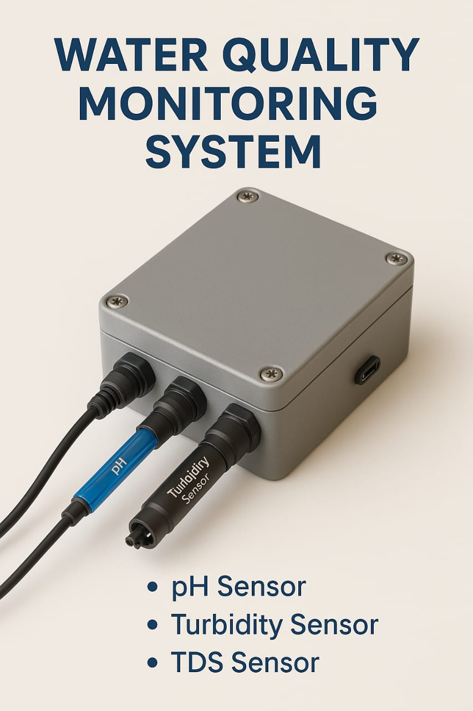

<p align="center">
   <a href="https://youtu.be/PTA77FuBi7M" target="_blank">
      
   </a>
</p>

<p align="center">
   <b>Product Idea</b><br>
   <a href="https://youtube.com/shorts/_hkLWM1ThnI" target="_blank">
      
   </a>
</p>
<p align="center">
   
</p>

# Water Quality Monitoring System

<p align="center">
   <a href="https://youtu.be/PTA77FuBi7M" target="_blank">
      
   </a>
</p>

<!-- For GitHub markdown, direct video embedding is not supported, but clicking the image will open the video. -->

<p align="center">
   
</p>

# Water Quality Monitoring System

A Flask-based web application for real-time water quality monitoring and analysis using IoT sensors and machine learning.

## Features

- Real-time water quality parameter monitoring (pH, TDS, Turbidity)
- Water Quality Index (WQI) calculation using both formula-based and ML approaches
- Interactive data visualization
- User authentication and authorization
- Admin dashboard for system configuration
- Integration with ThingSpeak IoT platform
- Responsive web interface

## Tech Stack

- **Backend**: Flask (Python)
- **Database**: SQLite
- **ML Framework**: scikit-learn
- **Data Visualization**: Matplotlib, Seaborn
- **Frontend**: HTML, CSS, JavaScript
- **IoT Integration**: ThingSpeak API

## Prerequisites

- Python 3.7+
- pip (Python package manager)
- Git

## Installation

1. Clone the repository:
```bash
git clone <repository-url>
cd project
```

2. Install dependencies:
```bash
pip install -r requirements.txt
```

3. Set up environment variables:
```bash
# For Windows
set SECRET_KEY=your_secret_key
set ADMIN_KEY=Vasu@123

# For Unix/Linux
export SECRET_KEY=your_secret_key
export ADMIN_KEY=Vasu@123
```

## Configuration

1. ThingSpeak Configuration:
   - Update `THINGSPEAK_CHANNEL_ID` and `THINGSPEAK_READ_API_KEY` in `app.py`
   - Configure your IoT sensors to send data to ThingSpeak

2. ML Model:
   - Place your trained model file at `wqi_model.pkl`
   - Place your scaler file at `scaler.pkl`

## Running the Application

1. Initialize the database:
```bash
flask db upgrade
```

2. Run the application:
```bash
python app.py
```

The application will be available at `http://localhost:5000`

## Project Structure

```
project/
├── app.py              # Main application file
├── requirements.txt    # Python dependencies
├── Procfile           # Railway deployment configuration
├── users.db           # SQLite database
├── static/            # Static files (CSS, JS, images)
└── templates/         # HTML templates
```

## API Endpoints

- `/`: Home page
- `/water_quality`: Real-time monitoring dashboard
- `/get_latest_data`: API endpoint for sensor data
- `/admin/dashboard`: Admin configuration panel
- `/login`, `/register`, `/logout`: Authentication endpoints

## Contributing

1. Fork the repository
2. Create a feature branch
3. Commit your changes
4. Push to the branch
5. Create a Pull Request

## Acknowledgments

- ThingSpeak for IoT platform
- Flask framework
- Railway for hosting platform 
